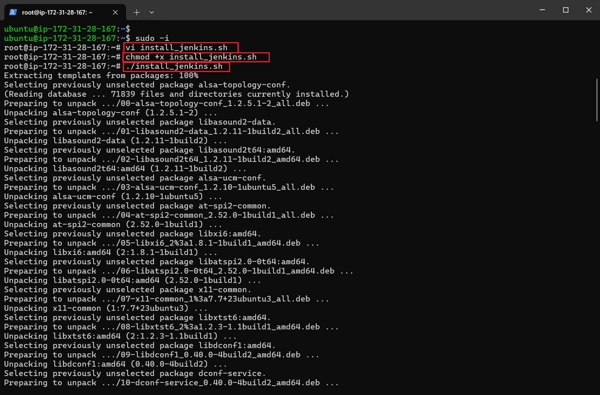
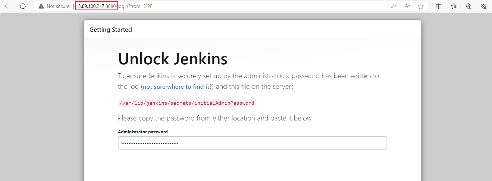
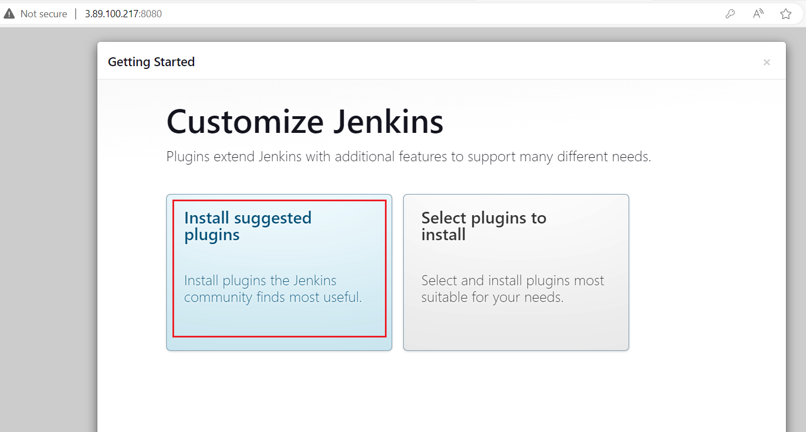
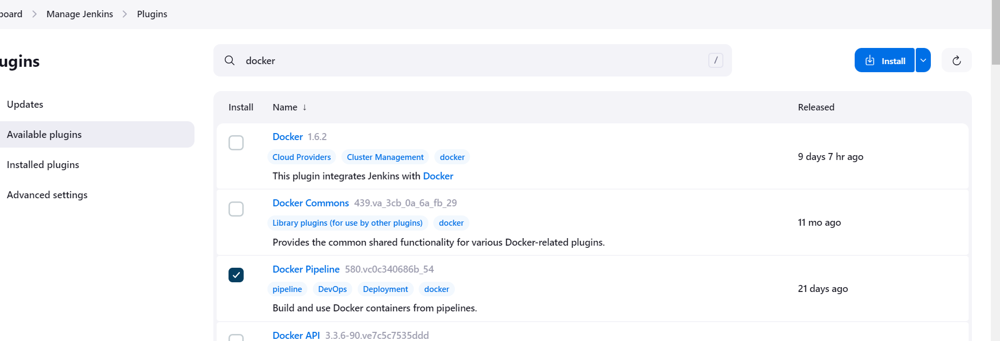
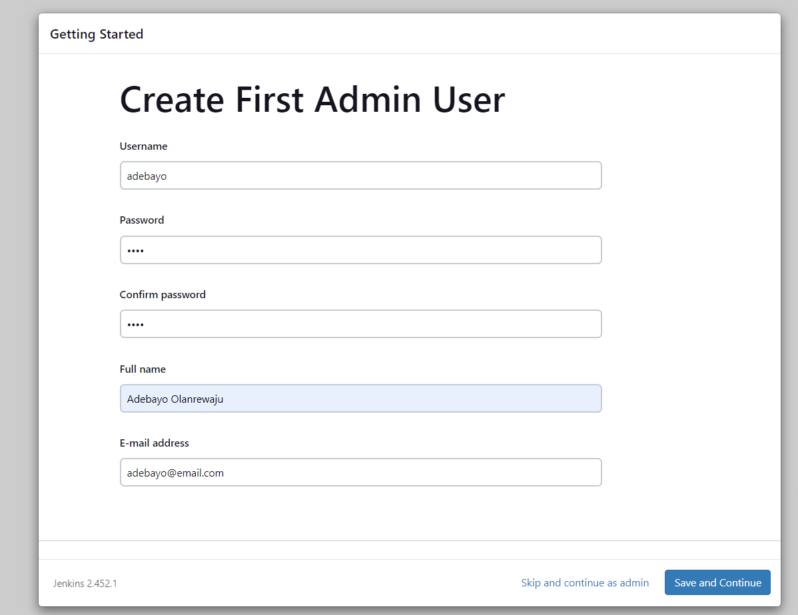
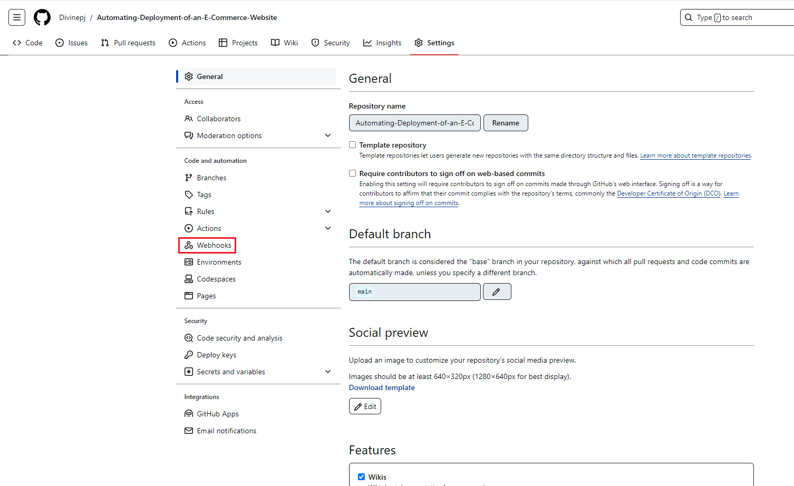

# Automating-Deployment-of-an-E-Commerce-Website
Automating Deployment of  an E-Commerce Website
this project seeks to automate the process of deployment of an e-commerce website using tools like Jenkins and Dockerhub.
we start by setting up a terminal and installing jenkins and its dependencies as shown below  we then proceed to log in to jenkins by inputing the password as shown below  we also procced to install the necessary plugins  and 
We also proceed to create an admin user as show below  we also procced to set up the webhook on the repository by going to the settings tab on github and configure the webhook as shown below  
On the jenkins portal we proceed to create our first freestyle project 