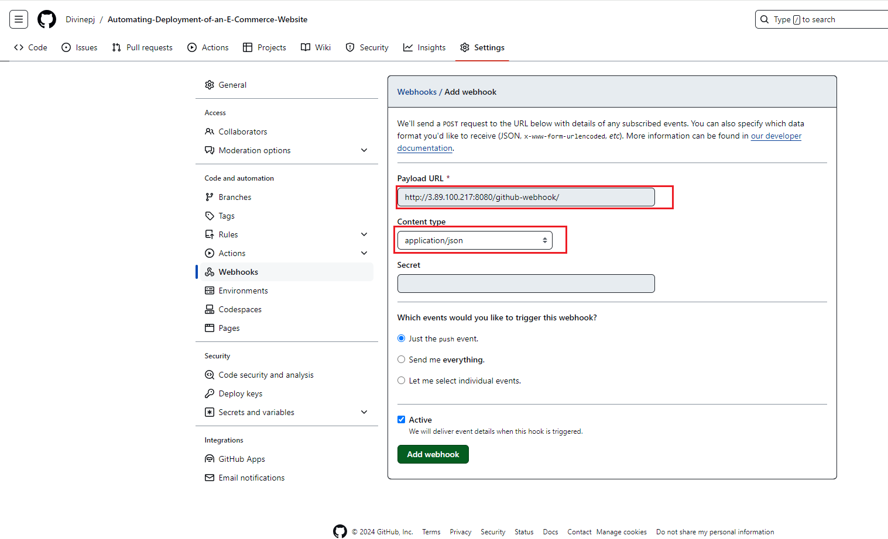

# Automating-Deployment-of-an-E-Commerce-Website
Automating Deployment of  an E-Commerce Website
this project seeks to automate the process of deployment of an e-commerce website using tools like Jenkins and Dockerhub.
## Jenkins server set up
we start by setting up an Ubuntu server on AWS, we also open `TCP port 8080` on the server. we then proceed to connect to the server on the windows terminal and install jenkins and its dependencies as by running a shell script saved on the server

```
{
#!/bin/bash

# Update system packages
sudo apt update

# Install Java (OpenJDK 11 is recommended for Jenkins)
sudo apt install -y openjdk-11-jdk

# Add Jenkins repository key
wget -q -O - https://pkg.jenkins.io/debian/jenkins.io.key | sudo apt-key add -

# Add Jenkins repository to apt sources
sudo sh -c 'echo deb http://pkg.jenkins.io/debian-stable binary/ > /etc/apt/sources.list.d/jenkins.list'

# Update package index again to include Jenkins repository
sudo apt update

# Install Jenkins
sudo apt install -y jenkins

# Start Jenkins service
sudo systemctl start jenkins

# Enable Jenkins to start on boot
sudo systemctl enable jenkins

# Print initial admin password to unlock Jenkins
echo "Jenkins initial admin password:"
sudo cat /var/lib/jenkins/secrets/initialAdminPassword

# Print Jenkins URL
echo "Jenkins URL: http://localhost:8080"

# Wait for Jenkins to fully start (optional)
echo "Waiting for Jenkins to start..."
sleep 30

# Display Jenkins service status
sudo systemctl status jenkins

}
```
 as shown below  we then proceed to log in to jenkins by inputing the administrator password and also procced to install the necessary plugins as shown below    
We also proceed to create an admin user as show below  
## Source Code Management Repository Integration
We then proceed to create a repository on github for the project and we set up a webhook on the repository by going to the settings tab on github and configure the webhook by setting the payload URL as the `public_IP_of_jenkins-server:8080/github-webhook/` and content type as `application/JSON` as shown below  


## Jenkins Freestyle Jobs for Build and Unit Tests
On the jenkins web portal we proceed to create our first freestyle project by selecting `new item` on the dashboard and configuring as follows  on the configuration page for the freestyle project we proceed to configure as follows  
we also confirm that the repository `Git` is correctly webhooked to jenkins by checking for a `green-check-mark` on the webhook configuration on jenkins as shown below 
We then proceed to push from our source code management tool (VSCode) to our repository and this immediately trigger the build job on the jenkins server as shown below 

## Jenkins Pipeline for a Web Application
Here we set up a new Item `pipeline job` as shown below to run a web application and also create a docker image to be saved on our docker repository.  on the source code management tool (VSCode) we proceed to create a new file `jenkinsfile` to hold the configuration for the build process as shown below 

```

pipeline {
    agent any

    environment {
        DOCKERHUB_CREDENTIALS = credentials('dockerhubid')  // Jenkins credentials ID for Docker Hub
        DOCKERHUB_REPO = 'adebayo2007/devops'    // Replace with your Docker Hub repository name
        IMAGE_TAG = "${env.BUILD_NUMBER}"
    }

    stages {
        stage('Build') {
            steps {
                script {
                    // Replace this with your actual build commands
                    echo 'Building Docker image...'
                    sh "docker build -t ${DOCKERHUB_REPO}:${IMAGE_TAG} ."
                }
            }
        }

        stage('Push') {
            steps {
                script {
                    echo 'Pushing Docker image to Docker Hub...'
                    docker.withRegistry('https://index.docker.io/v1/', 'dockerhubid') {
                        def dockerImage = docker.image("${DOCKERHUB_REPO}:${IMAGE_TAG}")
                        dockerImage.push()
                    }
                    echo 'Docker image pushed successfully.'
                }
            }
        }
    }

    post {
        always {
            // Clean up Docker images
            sh "docker rmi ${DOCKERHUB_REPO}:${IMAGE_TAG} || true"
            sh "docker rmi ${DOCKERHUB_REPO}:latest || true"
        }
    }
}

```
we also proceed to configure the pipeline as follows  !

## Docker Image Creation and Docker Push
we proceed to configure our server to run a docker configuration by crating an executable docker file on the server

```
{
# Use the official Node.js image as a base image
FROM node:14

# Set the working directory
WORKDIR /app

# Copy package.json and package-lock.json
COPY package*.json ./

# Install dependencies
RUN npm install

# Copy the rest of the application code
COPY . .

# Expose the application port
EXPOSE 3000

# Start the application
CMD ["npm", "start"]
}
```


 as shown below  we also proceed to set up the credential access on the jenkins portal by navigating through `credentials -> global credentials` as shown below  

 We then proceed to push the updated files to the repository which inturns creates a build job on the Jenkins server as shown nice  this is in turn reflected in the docker repository `adebayo2007/devops` as shown below  

 # THANK YOU